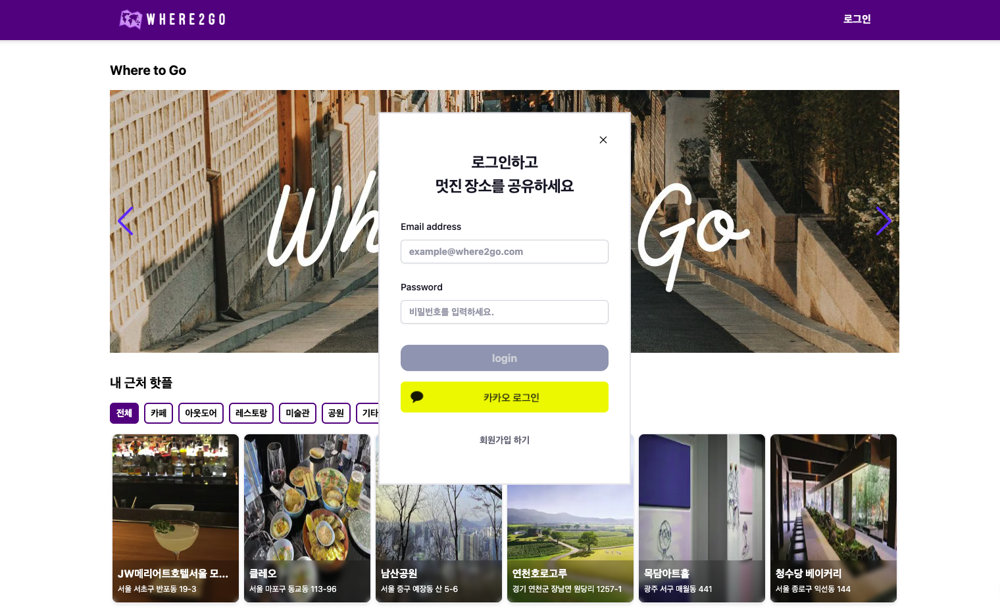
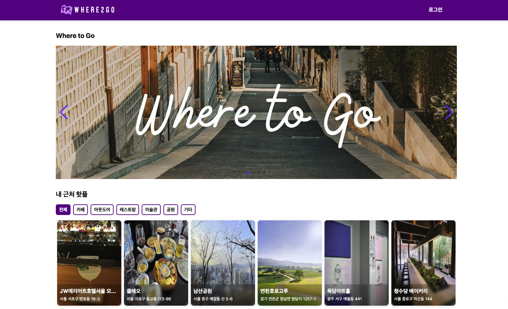
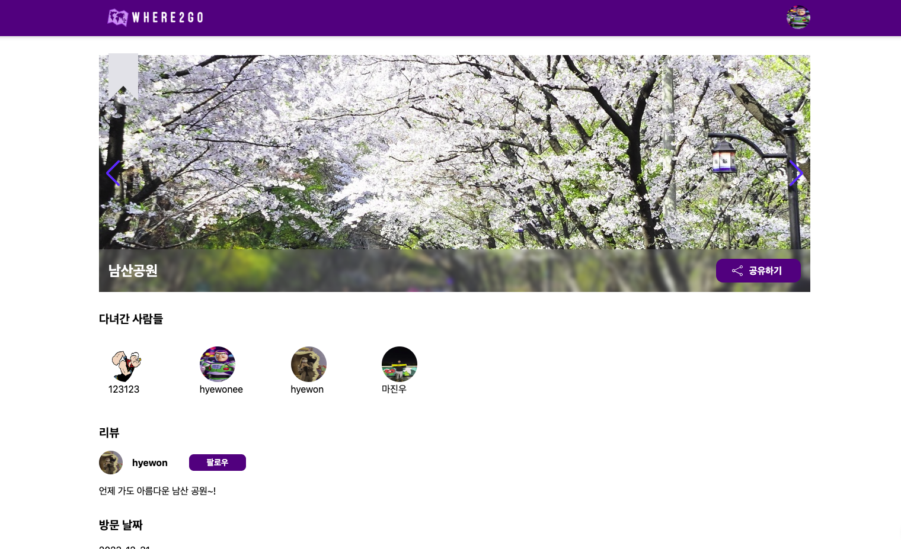
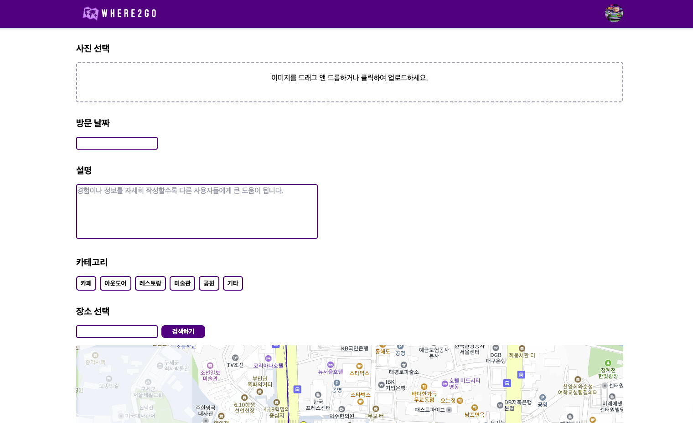
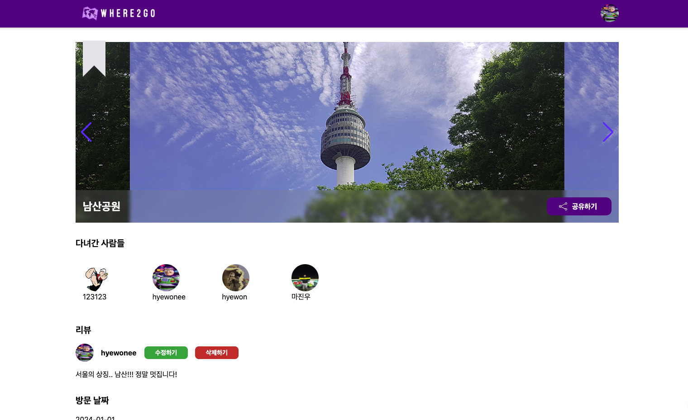
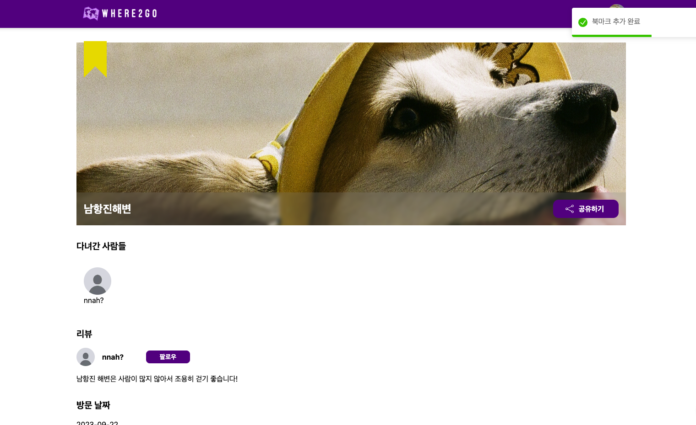
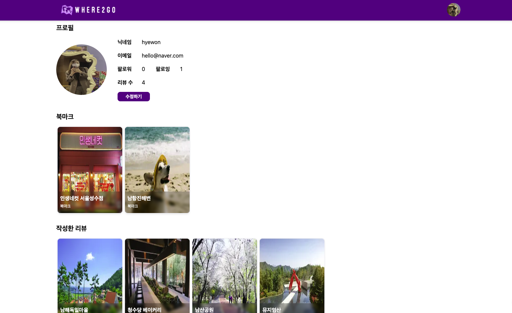
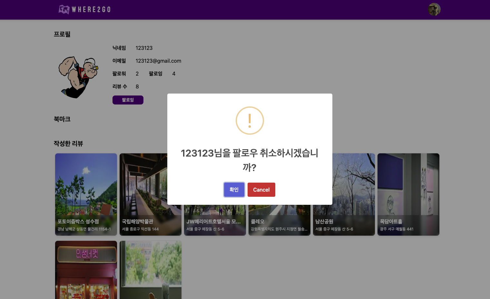

# Where to go (어디가지?)

## 프로젝트 소개

- 개요 : 자랑하고 싶은 숨은 명소들, 함께 즐기고 싶은 특별한 장소들을 공유하는 지도 기반의 소셜 플랫폼 입니다!
- 개발 기간 : 2023.12.26 ~ 2024.1.2

## 사용 기술

### 프론트 엔드

### 서버리스 DB

### 버전 관리

### 협업 툴

### 사이트

[프로젝트로 이동하기](https://where2-go.vercel.app/)

## 요구사항

### 🔵 필수 구현 사항

- 좋아요 또는 북마크 기능에 리액트쿼리 Optimistic Update 적용
- 팔로우 팔로우 취소 기능에 리액트쿼리 Optimistic Update 적용
- Supabase 적용
- Supabase 에서 제공하는 api를 이용하여 CRUD 데이터베이스 핸들링 구현
- 외래키를 활용한 데이터베이스 활용
- Supabase Authentication에서 제공하는 api를 이용하여 회원가입, 로그인 및 소셜 로그인 (카카오) 구현
- 게시물 작성 시 react-hook-form 라이브러리 적용
- redux 외의 다른 전역상태관리 라이브러리 적용 (zustand를 활용한 전역상태관리)

### 🔵 추가 구현 사항

- React Query의 enabled 옵션과 select 옵션을 이용하여 useQuery를 구현
- Supabase를 통해 오픈 소스 백엔드를 이용
- query-key를 다양한 방법(2가지 이상)으로 활용하기
- React Query의 mutate + invalidateQueries 조합을 사용하여 데이터 변경에 따른 실시간 갱신을 구현

## 주요 기능

- Supabase Authentication을 활용하여 로그인, 회원가입 및 소셜 로그인 (카카오)이 가능합니다. 
   

- 게시글을 카테고리 별로 필터링해서 볼 수 있습니다. 
  

- 하나의 장소에는 여러 사람들이 리뷰를 남길 수 있습니다. 
  

- 리뷰는 드래그 앤 드롭 또는 파일선택으로 여러 장 업로드 할 수 있으며 카카오 지도 API를 활용하여 장소 위치를 선택할 수 있습니다. 
  

- 다녀간 사람들 이미지를 클릭하면 다른 사람이 작성한 리뷰가 보이고, 수정 및 삭제는 자신이 작성힌 리뷰만 가능합니다. 
  
- 리뷰 상단에 책갈피 버튼을 클릭하면 게시글에 대한 북마크가 가능하며, 마이페이지에서 확인할 수 있습니다. 
  
  
- 유저에 대한 팔로우 및 팔로잉이 가능합니다. 
  

## 팀원 소개

|  이름  | GitHub                        | 블로그                         |
| :----: | ----------------------------- | ------------------------------ |
| 도경구 | https://github.com/4anghyeon  | https://doo9.tistory.com/      |
| 마진우 | https://github.com/nuny0831   | https://velog.io/@majinwoo1203 |
| 민예솔 | https://github.com/ys-oul     | https://velog.io/@_soul_       |
| 한혜원 | https://github.com/hyewon-han | https://velog.io/@hw1635       |
